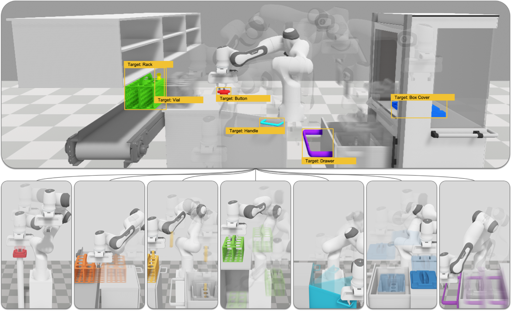

# RObotic MAnipulation Network (ROMAN) 
### ROMAN - Hybrid Hierarchical Learning for Solving Complex Sequential Tasks
The source code for running ROMAN as described and detailed in the accompanying manuscript.



## System Requirements
- **CPU:** Intel or AMD-Based Quad-Core or higher (For training)
- **GPU:** Discrete GPU is sufficient
- **RAM:** 8GB or higher
- **Disk Space:** Approximately 2GB of free space required
- **Operating System (OS):** Linux (Ubuntu) or Windows (10 or 11). Mac compatibility is limited but possible.

Generic computer hardware is sufficient and no non-standard hardware is necessary to run the project. 

## Cloning and Setting up Repository
    Root (This Repository)
    ├── ... (README.md and other files within root)
    ├── Assets                                        
    ├── Training (Adapted from ml-agents-0.15.1 -- bare minimum inclusion here)                                         
    ├── Packages                                    
    └── ProjectSettings 
    
Follow the below-mentioned steps to set up the project:
1. Clone this repository
2. The repository should resemble the above hierarchy   
    
There should be four folders within the root of this repository, in addition to `README.md` and some other miscellaneous files.

## Basic Installation Notes
Please first complete the section **Cloning and Setting up Repository**.

These installation notes are the bare minimum to get started with opening our project files, code and reviewing ROMAN's capabilities and internal architecture. Basic knowledge of Unity3D will aid in the overall understanding of the environment where ROMAN was created on.

1. Install [Unity Hub](https://unity.com/download)
2. Install [Unity3D Version 2019.3.0f6](https://unity.com/releases/editor/archive)
3. With Unity Hub open and the above Unity3D editor version installed, open the project root folder (this project)
4. Please proceed to section **How to Use and Run ROMAN**

**Typical Installation Time:** Approximately 30min

## (Optional) Additional Installation Notes
These are advanced installation notes for training models and agents within ROMAN. 
These are *NOT* needed to run or validate the framework, but rather to re-train the neural networks if needed.
To proceed, please first complete the **Basic Installation Notes** outlined above.

ROMAN makes use of the [ML-Agents Toolkit (Version 0.15.1)](https://github.com/Unity-Technologies/ml-agents/tree/0.15.1). 
This needs to be installed in order to train any models. 

Install the **mlagents** Python package for training, ideally via your virtual environment of choice.
For conda, please do the following:
1. Create your conda venv: ```conda create -n ml0.15.1-env python=3.6.9```
2. Activate the venv: ```activate ml0.15.1-env```
3. Upgrade pip if needed: ```pip install --upgrade pip```
4. Install mlagents and specify the version to match the project: ```pip3 install mlagents==0.15.1```
5. (Only Use if Needed) Specific numpy version may be needed ```pip install numpy==1.19.3```
6. Verify installation via ```mlagents-learn --help```, after which the Unity logo should appear in terminal

For more information and details, please also consult the [ML-Agents Toolkit Installation Notes (Version 0.15.1)](https://github.com/Unity-Technologies/ml-agents/blob/0.15.1/docs/Installation.md).

For information regarding virtual environments, you can find additional details [here](https://github.com/Unity-Technologies/ml-agents/blob/0.15.1/docs/Using-Virtual-Environment.md).

**Typical Installation Time:** Approximately 15min

## Project Folder Structure
The project is categorised into several folders. 
You will see four main folders:
- **Assets** -- Contains the main assets and core code of ROMAN
- **Training** -- The training hyperparameters, including the NN architectures in the form of .yaml files (parsed to ML-Agents)
- **Packages** -- Stores the installed packages of the project
- **ProjectSettings** -- The project settings, including the physics and time settings

Within the **Assets** folder we have the following hierarchy:

    Assets
    ├── Code                                         # Main code
    │   ├── Core                                     # The core code of ROMAN
    │   ├── Extensions and Functions                 # Secondary code used by ROMAN and helper functions
    │   └── Robot Functions and Sensors              # Contains robot-related code and simulated sensors
    ├── Demonstrations                               # The demonstrations provided by the human for imitation
    ├── Materials and Textures                       # Contains all materials and textures used for visualisation
    │   └── ...                                      
    ├── Meshes and 3D Models                         # The meshes and 3D models used for visualisation
    │   └── ...
    ├── Prefabs                                      # Stored instances (Details: https://docs.unity3d.com/Manual/Prefabs.html)
    ├── Robots                                       # The robots used in ROMAN (Franka Panda) and their characteristics
    │   └── ...
    ├── Scenes                                       # Main scenes of ROMAN with ready-to-start simulations
    │   ├── Heuristic - Imitation Scene              # Contains the scene to demonstrate/imitate custom behaviours via keyboard controls
    │   ├── Inference - Validation Scene             # Contains all trained NN models of ROMAN for validation or testing purposes
    │   └── Train - Training Scene                   # Scenes to train each individual component of ROMAN including the MN and the experts
    └── Trained Models                               # The trained models of ROMAN including the experts and the gating network

    
## How to Use and Run ROMAN
Requires to have completed **Basic Installation Notes**.

Furthermore, please familiarise yourself with the **Project Folder Structure**.

With the Unity3D editor open, you will have at your disposal the entire UI of the simulation.
At the bottom, you will see a tab named `Project`. Within this tab, you will be able to explore all the project hierarchies and folders of the main root folder `Assets`. Start by navigating to the `Scenes` folder where we have included several scenes containing ROMAN operating in the simulation environment.

For starters, we can quickly observe the full simulation of ROMAN by opening (double click) the scene file `Scene Primary - ROMAN`, located in the `Scenes` folder. With the scene now open, simply press play (<kbd>CTRL</kbd>+<kbd>P</kbd>) or click on the play button located at the top bar of Unity resembling a play button.

Within the `Scenes` folder, you will additionally find three sub-folders, named:
1. `Heuristic - Imitation Scene` -- Provide imitation/demonstration to each component of ROMAN 
2. `Inference - Validation Scene` -- To validate and observe each component of ROMAN
3. `Train - Training Scene` -- To train each component of ROMAN from scratch

### How to Use the `Heuristic - Imitation Scene`
These scenes allow us to conveniently provide our own demonstrations/imitations via our keyboard. **Disclaimer:** The actual demonstrations we have provided to ROMAN which were thereafter used for training are located under the `Demonstrations` folder. 

Each scene file is named accordingly to its usage and the type of demonstration/imitation we would like to record. Each recording will be created under `Assets > Demonstrations > Tests`.

#### Imitating Expert Behaviour
To imitate an expert, we have provided convenient key bindings to control the position of the end-effector gripper in all three dimensions XYZ, including Opening or Closing the gripper.

The specific keybindings are the following:

- <kbd>&#8592;</kbd> *Moves the gripper left (-Z)*
- <kbd>&#8593;</kbd> *Moves the gripper upwards (+Y)*
- <kbd>&#8594;</kbd> *Moves the gripper right (+Z)*
- <kbd>&#8595;</kbd> *Moves the gripper downwards (-Y)*
- <kbd>'</kbd> *Moves the gripper to the back (-X)*
- <kbd>/</kbd> *Moves the gripper to the front (+X)*
- <kbd><</kbd> *Closes the gripper*
- <kbd>></kbd> *Opens the gripper*
    
The aforementioned translational directions listed are all relative to the main rendering camera.
    
#### Imitating Master Behaviour
To imitate the behaviour of the master/gating neural network, also known as the **Manipulation Network (MN)**, we make use of corresponding weight assignments for each *demonstrated* and *trained* expert. To provide the weight assignments of the MN, we make use of the num pads or normal buttons of the keyboard. The keybindings of <kbd>1</kbd>, <kbd>2</kbd>, <kbd>3</kbd>, <kbd>4</kbd>, <kbd>5</kbd>, <kbd>6</kbd>, <kbd>7</kbd> provide the corresponding weights to each expert component of ROMAN.

**Important Note:** During demonstrations, please do **NOT** navigate away from Unity3D or change window focus as this will likely corrupt the demonstration file. To terminate the demonstration successfully, simply click the play button again or press <kbd>CTRL</kbd>+<kbd>P</kbd>.
    
### How to Use the `Inference - Validation Scene`
In this folder, we are able to validate and test ROMAN against different settings. Each scene file is named accordingly to its validated case and whether an individual expert is tested or the whole hierarchy including the MN. These scene files contain the fully trained models of ROMAN including the expert and MN. Once the scene is initiated/launched, the simulation will immediately start, whereby ROMAN will initiate and operate in the simulation environment completing complex long-time horizon sequential manipulation tasks.
    
### (Optional) How to Use the `Train - Training Scene`
*Requires to have completed all aforementioned sections.*

To train each component of ROMAN, including the experts and the MN, we have created multiple scenes for this purpose, each of which contains concurrent instances, denoted as "[C]" whereby C indicates the number of instances of the same brain, to accelerate training significantly.

To start training, please follow the below mentioned steps:
1. Open a terminal window
2. Activate your venv as described in the **(Optional) Additional Installation Notes** section
3. Navigate to the `Training` situated in the same directory as the `Assets` folder (all within `Root`)
4. With Unity3D open, open the desired training scene within the `Train - Training Scene` folder
5. Back in the terminal, run the command `mlagents-learn <trainer-config-path> --run-id=<run-identifier> --train`
    - `<trainer-config-path>` is the relative or absolute file path of the trainer configuration. The training .yaml files can be found from Root as follows: `Training > config`.
    - `<run-identifier>` is a string type used to identify the current training and can be named as needed
    - `--train` commands the mlagents toolkit to initiate training.
6. Once the training command is typed and entered in the terminal, mlagents will *wait* for the Unity3D editor. Now click on play (or press <kbd>CTRL</kbd>+<kbd>P</kbd>) on the Unity editor to start the training process. 

**Note:** For steps 5 and 6, please ensure to match the specified `.yaml` file (including the hyperparameters that are stored within the file) with the respective training scene of ROMAN situated in the `Train - Training Scene`. This is particularly important as to match the correct demonstration file with the training.
 
For more information on running these commands please consult the main [ML-Agents V0.15.1 Toolkit](https://github.com/Unity-Technologies/ml-agents/tree/0.15.1).

**Quick training example:** Open the scene titled `ROMAN - Master (Train) [Concurrent 24]` and instead of step 5, run the command  `mlagents-learn config/ROMAN_Master.yaml --run-id=ROMAN_Master_Training --train` and press play in the open scene in Unity3D (<kbd>CTRL</kbd>+<kbd>P</kbd>). This should automatically run the scene in training mode.

When running the above command in the terminal, the Unity logo should appear, indicating that the mlagents python package is active and awaiting to connect with our Unity3D editor. By pressing play on the Unity3D side at this point, it will automatically connect with our terminal session and will load the training parameters set in the `.yaml` file, located under `Training\config`.

The training times vary significantly based on the training approach, hyperparameters set in the `.yaml` file, system as well as hardware characteristics. To terminate the training in a safe manner, please stop the running Unity editor scene by either clicking the play button or pressing (<kbd>CTRL</kbd>+<kbd>P</kbd>). Avoid if possible terminating the training via the terminal as this may result in failing to successfully save the model.
    
For convenience, to train the whole ROMAN hierarchy, please open each respective scene situated in the `Train - Training Scene` and initiate training (as detailed above), with the following commands for both training the MN and experts of ROMAN:

```
mlagents-learn config/ROMAN_Master.yaml --run-id=ROMAN_Master_Training --train
mlagents-learn config/ROMAN_Expert_Button.yaml --run-id=ROMAN_Expert_Button_Training --train
mlagents-learn config/ROMAN_Expert_Push.yaml --run-id=ROMAN_Expert_Push_Training --train
mlagents-learn config/ROMAN_Expert_PickInsert.yaml --run-id=ROMAN_Expert_PickInsert_Training --train
mlagents-learn config/ROMAN_Expert_PickPlace.yaml --run-id=ROMAN_Expert_PickPlace_Training --train
mlagents-learn config/ROMAN_Expert_RotateOpen.yaml --run-id=ROMAN_Expert_RotateOpen_Training --train
mlagents-learn config/ROMAN_Expert_PickDrop.yaml --run-id=ROMAN_Expert_PickDrop_Training --train
mlagents-learn config/ROMAN_Expert_Pull.yaml --run-id=ROMAN_Expert_Pull_Training --train
```

The summary of training each component of ROMAN with the unique identifier (`--run-id`) can be found under `Training\summaries`. 
    
The trained models (`.nn` extension) can be found under `Training\models`. These can be placed within the `Assets` folder and loaded to each respective component of ROMAN for inference.
    
#### (Optional) Observe Training
With training active, as described above, we can observe the training progress by:
1. Open a new terminal
2. Follow steps 1, 2 and 3 from above
3. Run the command `tensorboard --logdir=summaries --port=6006`

This will open a new browser window with tensorboard showing us the active training (denoted as the --run-id i.e. identified we have set). 

## Additional Information
For additional information regarding the code, please see below.
    
### Inverse Kinematics Solver
For the Inverse Kinematics (IK) solver, we make use of a third-party asset for Unity3D to solve the kinematic chain to the end-effector gripper of the Franka Panda robot. Consequently, due to licensing requirements, we do not include the kinematic solver as part of the source code. The inclusion of the whole arm IK is purely for visualisation purposes as it does not influence ROMAN nor is it the aim of this research to focus on IK methods specifically. Rather, the IK solver itself aids in the overall visual depiction of the framework as presented visually in the manuscript.

### End Notes
Should there be any questions or clarification, please do not hesitate to contact us.
